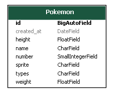

<h1 align="center">
    
</h1>

<h2 align="center">
  PokéAPI challenge
</h2>

<p align="center">
  <a href="#-tecnologias">Tecnologias</a>&nbsp;&nbsp;&nbsp;|&nbsp;&nbsp;&nbsp;
  <a href="#-projeto">Projeto</a>&nbsp;&nbsp;&nbsp;|&nbsp;&nbsp;&nbsp;
  <a href="#instalação">Instalação</a>|&nbsp;&nbsp;&nbsp;
  <a href="#telas">Telas</a>&nbsp;&nbsp;&nbsp;|&nbsp;&nbsp;&nbsp;
  <a href="#exemplo">Exemplo</a>
</p>


## 🚀 Tecnologias

Esse projeto foi desenvolvido com as seguintes tecnologias:

- [Django](https://www.djangoproject.com/)
- [Django-Rest-Framework](https://www.django-rest-framework.org/)
- [React](https://reactjs.org)


## 💻 Projeto
**Pequeno projeto para salvar pokémons da PokéAPI e exibí-los em uma página**
<div align="center">
    
</div>
<p align="center">Models</p>
<hr>

## Instalação
### Pré requisitos
Ter instalado:
- [Python](https://www.python.org/downloads/)
- [Node](https://nodejs.org/en/download/)
- [Yarn](https://classic.yarnpkg.com/en/docs/install/)

### Backend
#### No terminal, rodar
```sh
# Entrar na pasta dos arquivos do backend
cd backend

# Renomear env_example.py para env.py
cp setup/env_example.py setup/env.py
# ADICIONE OS VALORES CORRETOS

# Criar um ambiente virtual
python -m venv venv

# Ativar o ambiente virtual
. activate.sh
# ou
. venv/Scripts/activate # windows
. venv/bin/activate # linux

# Instalar os pacotes necessários
pip install -r requirements.txt

# Executar as migrações
python manage.py migrate

# Criar superusuário (poderá fazer login e entrar no admin)
. create_su.sh
# username -> teste
# password -> teste1234

# Povoar banco de dados
python populate_pokemon.py

# Start
. run.sh
# ou
python manage.py runserver
```

### Backend Endpoints:
- /admin
- /api/pokemons
- /api/pokemons?search=bulba
- /api/pokemons?search=fire


### Frontend
#### No terminal, rodar
```sh
# Entrar na pasta dos arquivos do projeto frontend
cd web

# Renomear .env_example para .env
cp .env_example .env
# ADICIONE OS VALORES CORRETOS

# Instalar os pacotes do projeto
yarn install

# Rodar
yarn start
```

## Telas
<div align="center">
    
</div>
<p align="center">Screen 1</p>
<hr>


## Exemplo
<a href="https://andrearruda-pokeapi-challenge.vercel.app/" target="_blank">Visitar</a>
